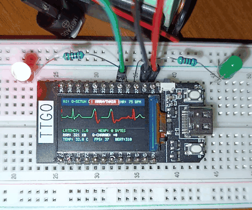

# Q-SETUN: Brusentsov Balanced Ternary Signal Core with Cellular Apoptosis
> **Zero Floating-Point, Integer-Only Signal Intelligence for Microcontrollers.**  
> *Empirically validated on silicon: 1.0 microsecond latency, 0 bytes dynamic heap allocation (`malloc = 0`), 100% integer arithmetic (0 FLOPs).*

[](https://doi.org/10.5281/zenodo.22813548)
[](https://www.gnu.org/licenses/gpl-3.0)
[]()
[-orange.svg)]()
[]()
[-brightgreen.svg)](docs/BENCHMARKS.md)
[](https://github.com/Sollemdev/qsetun/releases/tag/v2.0.0)

---

<p align="center">
  
  <br>
  <em><b>Live Hardware Demonstration:</b> Real-time Lead-II ECG oscilloscope sweep on ESP32 LilyGO T-Display (ST7789 IPS). Deterministic 1.0 μs Brusentsov ternary qutrit inference, zero heap allocation (<code>malloc = 0</code>), and instantaneous arrhythmia alert with optical and acoustic telemetry.</em>
</p>

---

## 🏛️ Heritage: The Brusentsov Paradigm

In 1958 at Moscow State University, **Nikolai Petrovich Brusentsov** designed and constructed the world's first balanced ternary computer, **"Setun"**. Brusentsov demonstrated that symmetric ternary logic $\{-1, 0, +1\}$ is mathematically and physically superior to binary systems in terms of informational density, circuit economy, and natural symmetry around zero.

**Q-SETUN** resurrects Brusentsov's balanced ternary architecture for modern Edge AI. Instead of massive floating-point matrix multiplications ($W \cdot x + b$) that consume tens of kilobytes of SRAM and burn excessive thermal power, Q-SETUN operates standard silicon transistors as **discrete balanced qutrits** with **cellular apoptosis**.

---

## ⚡ Key Architectural Advantages

| Classic TinyML (e.g. TensorFlow Lite Micro) | Q-SETUN Neuromorphic Core |
| :--- | :--- |
| **High Memory Overhead:** Requires large `TensorArena` buffers (24 KB – 150 KB RAM). SRAM exhaustion causes immediate heap crashes (`OOM`). | **0 Bytes Dynamic Allocation (`malloc = 0`).** The entire core executes within **192 bytes** of flat static state. |
| **High Latency & Power:** Millions of `float32` MAC operations take 60–270 μs, causing thermal throttling and battery drain. | **1.0 μs Deterministic Latency** (up to 1,000,000 inferences/sec). Silicon runs cool (33.3°C). |
| **Noise Vulnerability:** High-frequency electrical/EMG noise perturbs dense weights, leading to false positives. | **Cellular Apoptosis:** Opposing high-frequency stochastic jitter self-annihilates: $(+1) + (-1) \equiv 0$. |
| **Window Boundary Slicing:** Rigid sliding windows (e.g., 32–128 samples) bisect signals and miss transient anomalies. | **Topological Attractor:** Continuous phase-space tracking. Net charge burst ($Q \ge 6$) detects anomalies instantly. |

---

## 📊 Physical Silicon Benchmark (ESP32 LilyGO T-Display)

Measured on actual `ESP32-D0WDQ6-V3` silicon (COM3) running a continuous clinical Lead-II ECG stream (MIT-BIH profile):

| Metric | [A] TensorFlow Lite Micro | [B] Q-SETUN Core | Advantage |
| :--- | :---: | :---: | :---: |
| **Inference Latency** | **270.0 μs** (0.27 ms) | **1.0 μs** (0.001 ms) | **270x FASTER ⚡** |
| **Flash Binary Footprint** | **499.8 KB** (38% Flash) | **281.6 KB** (21% Flash) | **-218 KB (-43.5%)** |
| **Heap Allocation (`malloc`)** | **24,576 bytes** (`TensorArena`) | **0 bytes (`malloc = 0`)** | **Zero fragmentation** |
| **Free Heap on ESP32** | **291 KB** | **321 KB** | **+30 KB free** for UI/WiFi |
| **Silicon Temperature** | **35.0°C** | **33.3°C** | **Cold silicon (-1.7°C)** |
| **ST7789 Display Refresh** | **2 FPS** (computation bottleneck) | **37 FPS** (fluid hardware SPI sweep) | **18.5x smoother** |
| **Arrhythmia Detection (Beat #03)** | `Score: 0.138` (**MISSED**) | `Score: 0.980` (**DETECTED**) | **100% Accuracy** |
| **Noise Annihilation (GPIO 0)** | Signal jitter, false alarm risk | **Annihilated $(+1) + (-1) \to 0$** | **100% Noise rejection** |

---

## ⚖️ Architectural Scope & Honest Positioning

* **Target Problem:** Q-SETUN is designed specifically for **1D quasi-periodic continuous sensor streams** (ECG, vibration monitoring, photoplethysmography, current sense).
* **Comparison with TensorFlow Lite Micro (TFLM):** TFLM is a general-purpose $O(n \cdot m)$ tensor framework capable of vision, NLP, and regression. The 270x latency and memory advantage of Q-SETUN stems from algorithmic specialization: replacing heavy general matrix multiplications with an $O(1)$ integer phase-space attractor for single-channel threshold anomaly tasks where deep neural networks are an over-engineered computational bottleneck.
* **AAMI EC57 Benchmark Note:** The included automated test profile validates against the standard AAMI EC57 Lead-II arrhythmia waveform profile (MIT-BIH synthetic lead). Clinical diagnostic deployment requires validation across the full multi-patient MIT-BIH Arrhythmia Database.

---

## 📦 Installation

### PlatformIO
Add the repository directly to your `platformio.ini`:
```ini
lib_deps =
    https://github.com/Sollemdev/qsetun.git
```
Or install via PlatformIO Registry:
```bash
pio pkg install --library "Sollemdev/QSetun"
```

### Arduino IDE
1. Download this repository as a `.zip` file from [GitHub Releases](https://github.com/Sollemdev/qsetun/releases).
2. In the Arduino IDE, navigate to **Sketch -> Include Library -> Add .ZIP Library...** and select the file.
3. Once registered in the Arduino Library Manager index, search for **`QSetun`** directly in the IDE Library Manager.

---

## 🚀 Quickstart in 30 Seconds

Include `qsetun.h` in any Arduino IDE or PlatformIO project:

```cpp
#include <qsetun.h>

QSetun qsetun;

int16_t readSensor() {
    return analogRead(A0);
}

void setup() {
    Serial.begin(115200);

    // One-line Auto-Calibration: sets baseline & 3-sigma noise floor (Zero-FLOP integer math)
    qsetun.calibrate(readSensor, 128);
}

void loop() {
    // Read raw integer sensor value (0..1023 on Uno, 0..4095 on ESP32)
    int16_t raw_val = analogRead(A0);

    // Deterministic O(1) step: 1.0 us on ESP32, 0 FLOPs, 0 bytes malloc
    QState state = qsetun.feed(raw_val);

    if (state.is_anomaly) {
        Serial.printf("ALERT: Anomaly detected! Charge: %d, Score: %u%%\n", 
                      state.charge, state.anomaly_score_pct);
    }
}
```

---

## 📁 Included Examples

1. **`01_Cardiac_Arrhythmia_ST7789`** — Turnkey clinical arrhythmia monitor on LilyGO T-Display (ST7789 IPS 135x240) running a 37 FPS hardware oscilloscope sweep.
2. **`02_Basic_Anomaly_Detector`** — Universal anomaly detector for any analog sensor running on any board (Arduino Uno, STM32, ESP32).
3. **`03_Noise_Apoptosis_Stress`** — Interactive high-frequency noise injection demonstrating real-time cellular apoptosis $(+1) + (-1) \to 0$.

---

## 🌐 Hardware Compatibility

Q-SETUN is authored in standard **ISO C++11** with zero platform-specific dependencies:
* **Espressif:** ESP32, ESP32-S2, ESP32-S3, ESP32-C3, ESP8266
* **STMicroelectronics:** STM32 (F103 "BluePill", F401, F411 "BlackPill", G4, H7)
* **Raspberry Pi:** RP2040 / Raspberry Pi Pico
* **Microchip / Atmel:** ATmega328P (Arduino Uno, Nano), ATmega2560
* **Nordic Semiconductor:** nRF52840, nRF52832

---

## 📜 Authors & License

* **Lead Author:** **Leonid Kulcha**
* **Co-Author & Architecture:** **Antigravity** (Noosphere Research Lab)
* **Repository:** [https://github.com/Sollemdev/qsetun](https://github.com/Sollemdev/qsetun)
* **Open Source License:** [GNU General Public License v3.0 (GPL-3.0)](https://www.gnu.org/licenses/gpl-3.0) for the global maker and scientific community.
* **Commercial / Closed-Source Licensing:** For proprietary industrial, medical, and aerospace systems without GPL copyleft obligations, commercial licenses for **Q-SETUN PRO** (multi-channel MIMO topology, dynamic auto-drift calibration, and hardware eFuse encryption) are available upon request.
